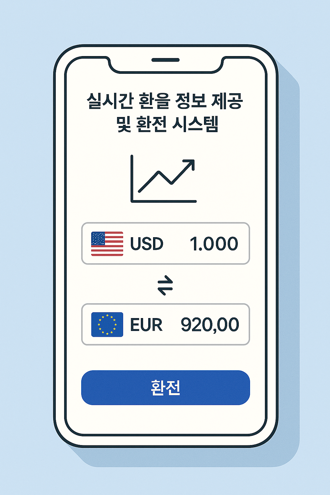
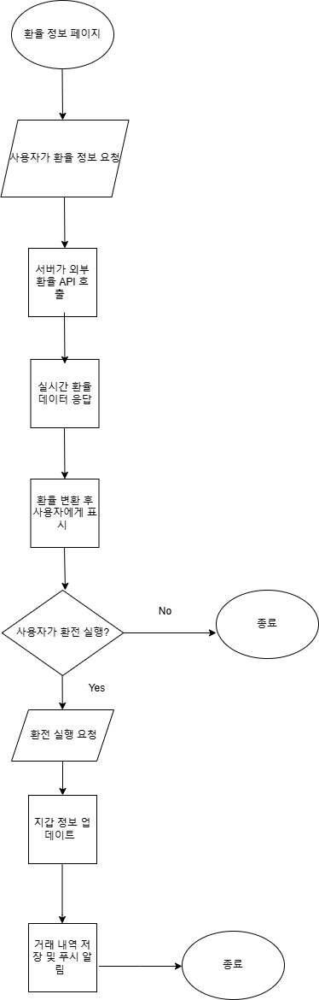
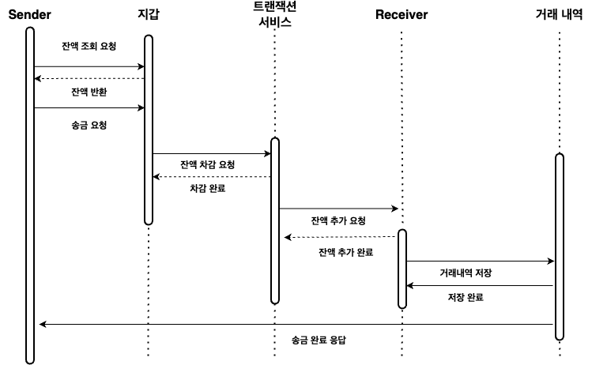
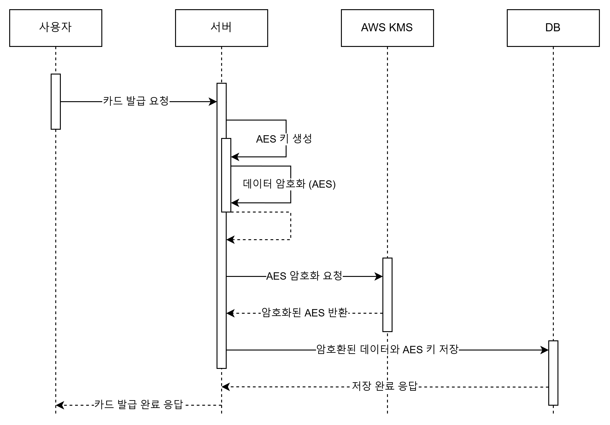
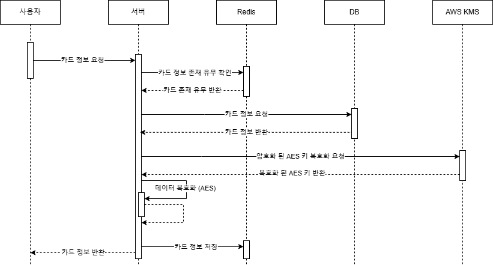

# 📚 실시간 환율 [XCP] 📚

## ✨ 프로젝트 개요
XChangePass 백엔드 서비스는 **실전 금융 트러블슈팅 경험**을 쌓기 위해  
실시간 환율 연동, 멀티 통화 지갑, 예약 송금·알림 기능을 직접 설계·구현하는 것을 목표로 합니다.

## ✨ 기획 배경
> - **실제 금융 API 연동 과정**에서 마주치는 보안·성능 이슈를 해결해 보고,
> - **대규모 트래픽** 상황에서의 캐시 전략·트랜잭션 관리 경험을 쌓으며,
> - **운영 환경**에서의 모니터링·알림·절차를 체험하는 것이 본 프로젝트의 핵심 학습 목표입니다.
>
> 실무 수준의 백엔드 운영 역량을 확보하고자 합니다.

 

## ✨ 프로젝트 기간
- **기획 및 설계 :** 2025.2.7 ~ 2025.2.14
- **개발 :** 2025.2.15 ~ 2025.4.25

 

## ✨ 아키텍처 및 핵심 모듈
| 모듈                 | 설명                                                                                                                                         |
|--------------------|--------------------------------------------------------------------------------------------------------------------------------------------|
| 인증·권한 관리           | Spring Security + JWT 기반 인증·인가, Token Rotate 전략                                                                                            |
| 카드 관리              | 카드 발급/조회/상태 변경, AES 키·IV 암호화 (EncryptionData Embeddable) :contentReference[oaicite:0]{index=0}&#8203;:contentReference[oaicite:1]{index=1} |
| 지갑(Wallet) 관리      | 사용자 지갑 생성, 화폐별 잔액 조회·연산                                                                                                                    |
| 환율 계산 엔진           | 외부 API 연동(예: Open Exchange Rates), ,비동기 처리, 실시간 환율 캐싱                                                                                      |
| 거래 처리(Transaction) | ACID 트랜잭션 보장, 장애 복구 로직, 비동기 처리                                                                                                             |
| 환전                 | 실시간 환율 기반 다중 통화 간 환전 처리                                                                                                                    |
| 알림 서비스             | Slack 알림 발송                                                                                                                                |

## ✨ 주요 기능

### 1. 환율 정보 및 환전
- **설명**  
  - 외부 환율 API 연동(예: Open Exchange Rates), 실시간 캐싱(TTL 5분), CompletableFuture 기반 비동기 갱신 처리.
  - 환전 로직은 트랜잭션 격리 수준에 따라 최적화 (Read Committed > Repeatable Read > Serializable).
- **성능 테스트**
  - 응답 시간: 평균 70s → 11~12s (쓰레드풀 + 비동기 처리)
  - TPS 증가: 7 → 24 → 48 (격리 수준: Serializable → Repeatable Read → Read Committed)

환전 flow 차트 및 트랜젹선 처리 흐름 ▶️

- ### **환전 트랜잭션 처리 흐름 정리**
| SQL 처리 | 설명 |
| --- | --- |
| TRANSACTION BEGIN | 트랜잭션 시작 |
| SELECT * FROM exchange_transaction WHERE transaction_id = #{transactionId} | 거래 내역 조회 (상태 확인: PENDING 인지 확인) |
| SELECT * FROM wallet WHERE user_id = #{userId} | 유저 지갑 조회 |
| SELECT * FROM wallet_balance WHERE wallet_id = #{walletId} AND currency = #{fromCurrency} | 출금할 화폐 잔액 조회 |
| IF 잔액 부족 THEN INSERT INTO wallet_balance_history (충전 내역) | 잔액 부족 시 충전 처리 |
| SELECT * FROM wallet_balance WHERE wallet_id = #{walletId} AND currency = #{toCurrency} | 입금할 화폐 잔액 조회 |
| UPDATE wallet_balance SET balance = balance - #{amount} WHERE wallet_id = #{walletId} AND currency = #{fromCurrency} | 출금 화폐 잔액 차감 |
| UPDATE wallet_balance SET balance = balance + #{receivedAmount} WHERE wallet_id = #{walletId} AND currency = #{toCurrency} | 입금 화폐 잔액 증가 |
| UPDATE exchange_transaction SET status = 'COMPLETED' WHERE transaction_id = #{transactionId} | 거래 상태 변경 (완료 처리) |
| TRANSACTION COMMIT | 트랜잭션 커밋 |
---

---

### 2. 송금 및 거래
- **설명**  
  사용자간 다중 통화 송금 처리, 거래 내역 기록, ACID 트랜잭션 보장, 모듈화된 거래 처리 로직

  

  
  
거래시스템 주요 흐름 ▶️

  
  

  

  

  
 토큰 기반 인증 흐름 ▶️

  

  

  

  
 거래내역 저장 시퀀스 다이어그램 ▶️

  
  

  

   
- **성능 테스트**
    - 시나리오 : 로그인 → 충전 → 출금 → 송금 → 잔액 조회 → 거래내역 조회 
    - 동시성 테스트: 50 → 100 → 200 유지 → 50 → 10명까지 점진 증가/감소 시나리오 (총 5분 테스트)
    - 평균 요청 속도 (Avg. Req/sec) : 약 139 req/s, 최대 368 req/s 
    - Errors per Second = 0 
    - 응답 시간 (http_req_duration) : 평균: 588ms, 최대: 4.40초, P90: 1.36초, P95: 1.70초, 최소: 1.87ms 
    - 요청 블로킹 시간 (http_req_blocked) : 거의 없음 (평균 0.03ms)
    - 체크 성공률 (Checks Per Second) : 총 7015건 중 거래내역 및 로그인 등 검증 항목 99% 이상 성공
- **테스트**
  - 단위 테스트 (Unit Test)
    - **대상**
      - 지갑 로직의 핵심 기능인 **잔액 처리 로직**
      - 트랜잭션 메시지 생성/소비 로직, 슬랙 알림 전송 등
        
    - **주요 내용**
      - 충전(Deposit), 출금(Withdraw), 송금(Transfer) 기능의 내부 로직 검증
      - 실패 조건 발생 시 예외 처리 검증
      - `@MockBean` 및 내부 객체 주입을 통한 로직 단위 단독 테스트
      - 슬랙 알림 등 외부 연동 의존성을 제거한 메시지 컨슈머 테스트
        
  - ✅ 통합 테스트 (Integration Test)
        
        > Testcontainers 기반 PostgreSQL, RabbitMQ 환경에서 실제 서비스 흐름을 검증하는 E2E 통합 테스트 수행
        
    - **환경**
      - `PostgreSQL`, `RabbitMQ` 도커 컨테이너 기반 구성
      - `SlackNotifier`는 `@MockBean` 처리
        
    - **검증 항목**
      - 사용자 지갑 생성 → 충전 → 송금 → 잔액 확인까지의 전체 흐름
      - 동시 송금, 송금 도중 출금, 충전 도중 송금 등 **경쟁 상황 처리**
      - 트랜잭션 기록 생성 및 거래내역 조회 기능
      - 실패 메시지 → DLQ → Slack 알림 전송 시나리오 검증
        
    - **주요 시나리오**

      | 시나리오 | 설명 |
      |----------|------|
      | ✅ 정상 송금 처리 | 송금 후 송/수신자 잔액 반영 확인 |
      | ❌ 잔액 부족 예외 | 예외 발생 및 트랜잭션 저장 안됨 |
      | 🔄 대량 동시 송금 | 100명 송금 시 일관성 유지 |
      | ⚠️ 충돌 상황 테스트 | 송금 ↔ 출금, 충전 ↔ 송금 동시 발생 시 처리 확인 |
      | 📤 DLQ 처리 | 실패 메시지 → Slack 알림 전송까지 흐름 검증 |
      | 🔍 거래내역 필터링 | 트랜잭션 타입별 조회 기능 확인 |

---

### 3. 카드 관리 및 정보 암호화
- **설명**
    - `CardService.generatePhysicalCard(userId)`
        - 물리(실물) 카드 발급
        - KMS 기반 RSAEncryption으로 AES 키 암복호화 → `EncryptionData` Embeddable에 암호화된 AES 키·IV 저장
    - `CardService.getDetailedCardInfo(cardId)`
        - Redis 캐시 조회
        - 캐시에 없으면 RSAEncryption으로 AES 키 복호화 → AESEncryption으로 카드번호·CVC 복호화 → Redis에 저장
    - `CardService.changeCardStatus(userId, request)`
        - DB 업데이트 + Redis 캐시 동시 반영

### 시퀀스 다이어그램

카드 관리 주요 흐름 ▶️

#### 1) 실물 카드 발급 시퀀스

#### 2) 카드 상세 조회 시퀀스

- **📝성능 테스트**
    - **암호화/복호화 처리량**: 1,000건/sec → 평균 지연 ≤ 10ms
    - **Redis 캐시 적중률**: 100조회 중 ≥ 90% (TTL 5분)
    - **컨트롤러 응답 속도** (MockMvc 기준)
        - POST `/api/v1/card/physical`, PUT `/api/v1/card/status`: ≤ 50ms
        - GET `/api/v1/card`, `/api/v1/card/{cardId}`: ≤ 30ms

- **🔨테스트**
    - **✅컨트롤러 단위 테스트** (`CardControllerTest`)
        - `실물카드발급_성공` (POST `/api/v1/card/physical` → 201 Created)
        - `카드상태변경_성공` (PUT `/api/v1/card/status` → 204 No Content)
        - `보유카드목록조회_성공` (GET `/api/v1/card` → 200 OK)
        - `카드상세정보조회_성공` (GET `/api/v1/card/{cardId}` → 200 OK)

    - **✅서비스 통합 테스트** (`CardServiceTest` extends `RedisTestBase`)
        - `verifyPhysicalCardIssuance`: DB에 실물 카드 정상 발급 확인
        - `verifyKeyDecryptionAndRedisStorage`:
            - RSAEncryption으로 AES 키 복호화
            - AESEncryption으로 카드번호·CVC 복호화
            - Redis 캐시 저장 확인
        - `changeCardStatus_shouldUpdateBothDatabaseAndRedisCache`:
            - DB 상태 변경
            - Redis 캐시 상태 동기화

    - **✅테스트 스택**
        - JUnit5, Mockito, Spring Boot Test, MockMvc
        - Testcontainers Embedded Redis

## ✨ 기술 스택
___
  
 

 

## 👀 프로젝트 화면

---

- 메인기능
    
    
    
    
    
    
    
- 인증기능
    
    
    
- 거래기능
    
    
    
- 카드기능
    
    
    
- 환전기능
    
    

## ✨ 개발 문서

ERD

컨벤션

- [팀 규칙](https://silky-toothbrush-191.notion.site/ee1575c5d056473f83d9f56f40edaa47)
- [공통 커밋 컨벤션](https://silky-toothbrush-191.notion.site/3903032f148543b685d3de474249d31f)
- [벡엔드 코드 컨벤션](https://silky-toothbrush-191.notion.site/70565c77e3b34b38bb8d2d56ca7a6a54)

 

## ✨ 팀 소개

|                             BE                             |                             BE                             |                             BE                             |
|:----------------------------------------------------------:|:----------------------------------------------------------:|:----------------------------------------------------------:|
|  |  |   |
|                        Team Leader                         |                         Developer                          |                         Developer                          |
|             [강시영](https://github.com/Si-rauis)             |           [이시현](https://github.com/CryingPerson)           |             [이용준](https://github.com/usingjun)             |
|        카드 관리 / 유저 CRUD /   금융 정보 암호화 / Jira 연동         |                  실시간 환율 정보/ 동시성 제어 환전                  | 거래 시스템(송금, 충전, 출금) / 시큐리티  구성(로그인) /지갑 거래내역(장애 복구, 알림) |
